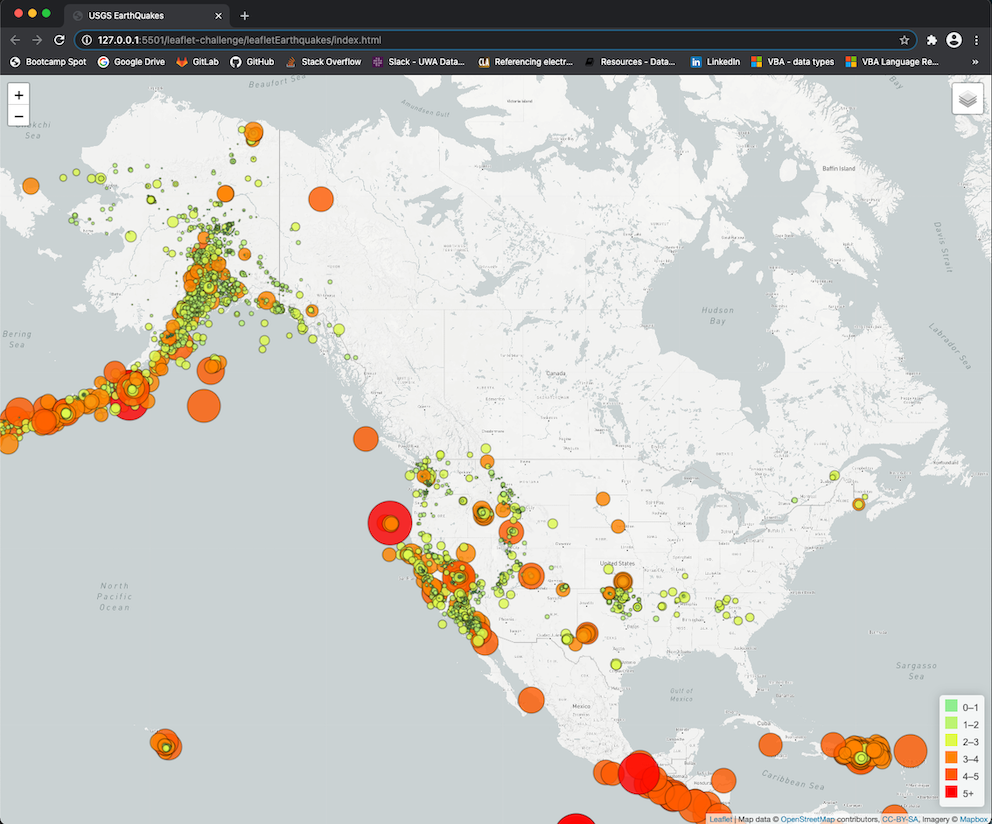

# leaflet-challenge
UWA Boot Camp Data Analytics - homework assignment 17 - Leaflet - USGS Earthquakes

# leaflet-challenge
- UWA Boot Camp Data Analytics
- Homework Assignment 17 - Leaflet - USGS Earthquakes
- [Anthony van der Wal](https://anthonyvanderwal.github.io/my-first.html) - 16 January 2021.
  

---
### USGS Earthquakes - last 30 days
- [website](https://anthonyvanderwal.github.io/leaflet-challenge/leafletEarthquakes/) deployed on GitHub Pages.
- [javascript](./leafletEarthquakes/static/js/logic.js) app to render plot.
- [html](./leafletEarthquakes/index.html) template for website.
- [css](./leafletEarthquakes/static/css/style.css) with style for template.

---
### Screenshot
**Website**  
<kbd></kbd>

